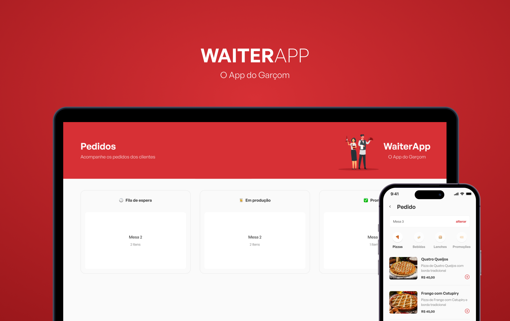

<div align="center"> 
  
</div>

## About

Waiter app is an application developed to assist with the order flow in a restaurant. Through it, waiters and those responsible for preparing the orders can have better analysis, preparation, and organization in the work environment.

The project features both a mobile and a web application that complement each other. The mobile app allows waiters to view the product menu and create customer orders, while the web version includes a dashboard divided into 3 production stages according to the order's preparation: waiting queue, in production, and completed.

## Layout

[**Figma**](https://www.figma.com/file/Ivct0qKlCFhWIIPrC5yHBF/WAITERAPP?node-id=216%3A1787&t=4ByEfZEfoA5QrxMn-0)

<div align="center"> 
  
</div>

## Techs

- [React](https://reactjs.org/) ✅
- [React Native](https://reactnative.dev/) ✅
- [Node.js](https://nodejs.org/en/) ✅
- [TypeScript](https://www.typescriptlang.org/) ✅
- [Expo](https://expo.dev/) ✅
- [Styled Components](https://styled-components.com) ✅
- [MongoDB](https://www.mongodb.com) ✅
- [Docker](https://www.docker.com/) ✅

## How to use

```
- Clone this repository:
$ git clone https://github.com/davi1985/waiterapp

- Navigate to directory:
$ cd waiterapp

- Go into each project directory and install the dependencies for each::
$ yarn install

- Start the applications:
$ yarn dev
```

<hr/>

<p align="center">
  Made with 💚 by <a href="https://github.com/davi1985">Davi Silva</a>
</p>
